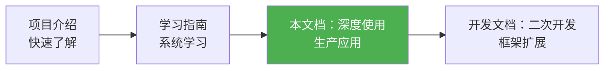
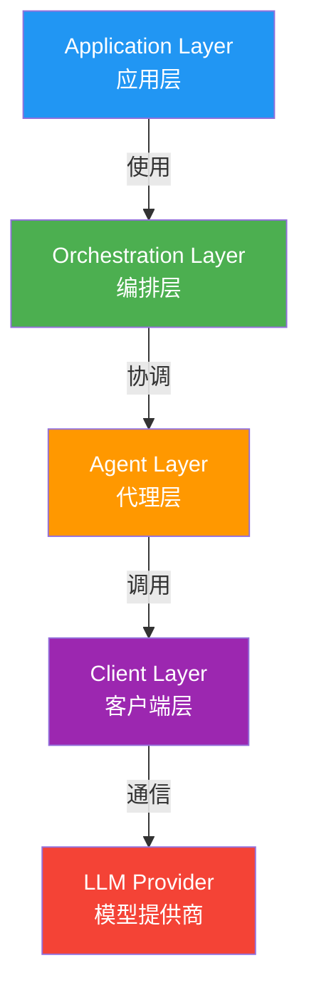
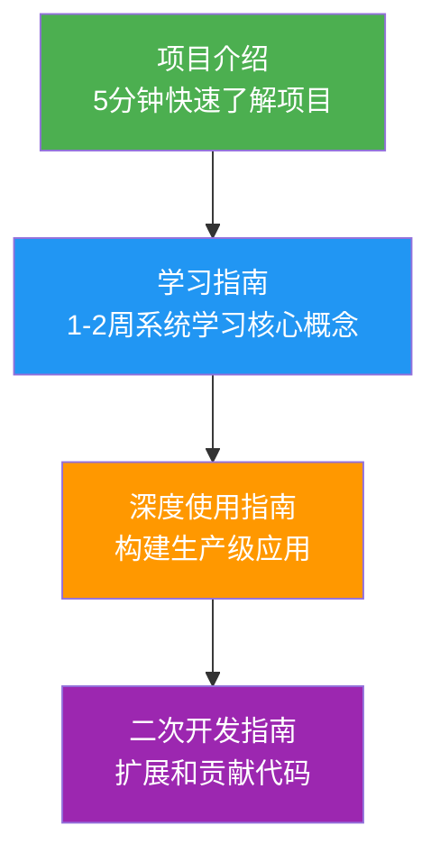
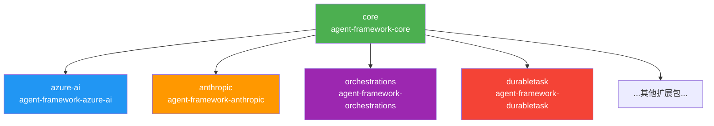
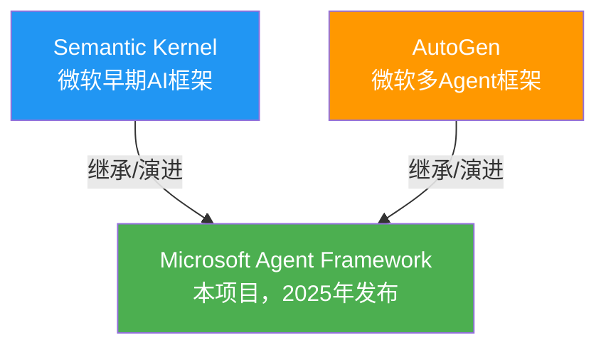

# 文档图表更新日志

> 📅 更新时间：2026年2月26日
>
> 本文档记录了将所有文档图表统一转换为 Mermaid 格式的更新内容。

---

## 📊 更新概览

### 更新统计

- **更新文档数**: 4份
- **转换图表数**: 5个
- **保留原格式**: 2个（代码树形结构）

### 更新原则

1. **ASCII art图表** → Mermaid流程图
2. **文本层级图** → Mermaid图表
3. **代码目录结构** → 保留原格式（更直观）
4. **代码示例** → 保留原格式（展示实际代码）

---

## ✅ 已更新的图表

### 1. `user_guide_advanced.md`

#### 1.1 学习路径图（第31-38行）

**更新前**: ASCII art文本图
```
学习路径：
[项目介绍] → [学习指南] → [本文档：深度使用] → [开发文档：二次开发]
     ↓            ↓              ↓                    ↓
  快速了解    系统学习      生产应用              框架扩展
```

**更新后**: Mermaid流程图


**优势**:
- ✅ 可视化更清晰
- ✅ 支持颜色高亮
- ✅ 自动渲染

#### 1.2 架构层次图（第62-73行）

**更新前**: Python注释风格
```python
# 层级关系示意
Application Layer (应用层)
    ↓ 使用
Orchestration Layer (编排层)
    ↓ 协调
Agent Layer (代理层)
    ↓ 调用
Client Layer (客户端层)
    ↓ 通信
LLM Provider (模型提供商)
```

**更新后**: Mermaid图表


**优势**:
- ✅ 层次关系更直观
- ✅ 每层有独特颜色标识
- ✅ 关系标签清晰

---

### 2. `README.md`

#### 2.1 学习路径图（第13-27行）

**更新前**: ASCII art盒子图
```
┌─────────────────┐
│  项目介绍       │  ← 5分钟快速了解项目
└────────┬────────┘
         ↓
┌─────────────────┐
│  学习指南       │  ← 1-2周系统学习核心概念
└────────┬────────┘
         ↓
...
```

**更新后**: Mermaid流程图


**优势**:
- ✅ 更现代化的视觉效果
- ✅ 颜色区分不同阶段
- ✅ 描述信息保留完整

---

### 3. `developer_guide.md`

#### 3.1 包依赖关系图（第126-133行）

**更新前**: ASCII art树形图
```
core (agent-framework-core)
  ├─→ azure-ai (agent-framework-azure-ai)
  ├─→ anthropic (agent-framework-anthropic)
  ├─→ orchestrations (agent-framework-orchestrations)
  ├─→ durabletask (agent-framework-durabletask)
  └─→ ...（其他扩展包）
```

**更新后**: Mermaid依赖图


**优势**:
- ✅ 依赖关系一目了然
- ✅ 核心包突出显示
- ✅ 扩展包分色标识

---

### 4. `learning_guide.md`

#### 4.1 框架关系图（第51-64行）

**更新前**: ASCII art层级图
```
                    ┌─────────────────────────┐
                    │   Microsoft Agent       │
                    │   Framework             │
                    │ (本项目，2025年发布)      │
                    └───────┬─────────────────┘
                            │ 继承 / 演进
              ┌─────────────┼─────────────────┐
              │                               │
    ┌─────────▼──────────┐       ┌────────────▼──────────┐
    │  Semantic Kernel   │       │    AutoGen            │
    │  (微软早期AI框架)   │       │  (微软多Agent框架)     │
    └────────────────────┘       └───────────────────────┘
```

**更新后**: Mermaid关系图


**优势**:
- ✅ 演进关系更清晰
- ✅ 避免ASCII art的兼容性问题
- ✅ 更专业的视觉呈现

---

## 🔍 保留原格式的内容

### 1. 目录结构（多处）

**原因**: 
- 树形文本格式最直观地展示文件系统结构
- 与终端 `tree` 命令输出一致
- 易于复制粘贴到终端验证

**示例**:
```
python/
├── pyproject.toml
├── packages/
│   ├── core/
│   │   ├── agent_framework/
│   │   └── tests/
│   └── ...
├── samples/
└── tests/
```

### 2. 代码示例

**原因**:
- 展示实际可运行的代码
- 保持语法高亮
- 便于复制粘贴

**示例**:
```python
class ChatAgent:
    def __init__(self, ...):
        pass
```

---

## 🎨 Mermaid 样式规范

### 颜色方案

| 颜色 | 十六进制 | 用途 |
|------|---------|------|
| 绿色 | #4CAF50 | 核心/当前文档/主要节点 |
| 蓝色 | #2196F3 | 基础/客户端/第二层级 |
| 橙色 | #FF9800 | 进阶/代理/第三层级 |
| 紫色 | #9C27B0 | 高级/中间件/第四层级 |
| 红色 | #F44336 | 外部/模型/第五层级 |

### 图表类型选择

| 场景 | 图表类型 | 示例 |
|------|---------|------|
| 线性流程 | `graph LR` | 学习路径 |
| 层次结构 | `graph TD` | 架构层次 |
| 依赖关系 | `graph TD` | 包依赖 |
| 时序过程 | `sequenceDiagram` | 请求流程 |
| 类继承 | `classDiagram` | 类关系 |

---

## ✨ 更新收益

### 1. 可读性提升
- ✅ 图表渲染更专业
- ✅ 颜色区分更清晰
- ✅ 关系标注更明确

### 2. 维护性改善
- ✅ 使用标准Mermaid语法
- ✅ 易于修改和扩展
- ✅ 版本控制友好

### 3. 兼容性增强
- ✅ GitHub自动渲染
- ✅ GitLab自动渲染
- ✅ VSCode预览支持
- ✅ Typora等编辑器支持

### 4. 国际化友好
- ✅ 避免ASCII art显示问题
- ✅ 支持多语言标签
- ✅ Unicode字符正确显示

---

## 📝 使用建议

### 在Markdown编辑器中查看

**VSCode**:
1. 安装插件：`Markdown Preview Mermaid Support`
2. 按 `Ctrl+Shift+V` 预览

**Typora**:
- 自动渲染Mermaid图表，无需额外配置

**GitHub/GitLab**:
- 推送后自动渲染，无需额外操作

### 导出为图片

如需将Mermaid图表导出为图片：

```bash
# 安装mermaid-cli
npm install -g @mermaid-js/mermaid-cli

# 导出为PNG
mmdc -i diagram.mmd -o diagram.png

# 导出为SVG
mmdc -i diagram.mmd -o diagram.svg
```

---

## 🔄 后续维护

### 新增图表时

1. **优先使用Mermaid**: 除非特殊需求（如代码目录结构）
2. **遵循颜色规范**: 使用统一的颜色方案
3. **添加适当注释**: 使图表易于理解

### 修改现有图表

1. **测试渲染效果**: 确保在主流平台正确显示
2. **保持一致性**: 与其他图表风格一致
3. **更新文档**: 同步更新本日志

---

## 📚 参考资源

- [Mermaid官方文档](https://mermaid.js.org/)
- [Mermaid Live Editor](https://mermaid.live/)
- [GitHub Mermaid支持](https://github.blog/2022-02-14-include-diagrams-markdown-files-mermaid/)

---

*更新完成！所有主要图表已转换为Mermaid格式。* ✅
