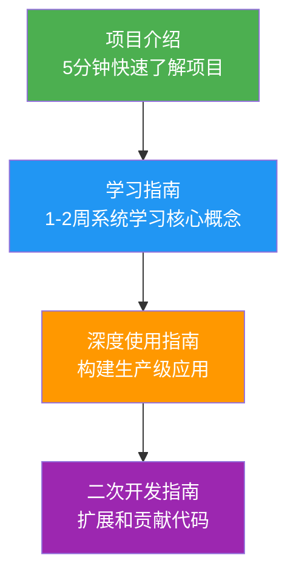

# Microsoft Agent Framework 中文文档索引

> 📅 最后更新：2026年2月26日
>
> 本目录包含 Microsoft Agent Framework 的完整中文文档体系，帮助你从入门到精通该框架。

---

## 📚 文档体系

### 学习路径图



---

## 📖 文档列表

### 1. [项目介绍](./project_introduction.md)

**适合人群**: 所有人

**阅读时长**: 5-10分钟

**内容概要**:
- 项目概述和核心特性
- 技术架构一览
- 快速开始指南
- 项目结构说明

**何时阅读**: 第一次接触项目时

---

### 2. [学习指南](./learning_guide.md)

**适合人群**: 初学者到中级用户

**阅读时长**: 1-2周（建议分阶段学习）

**内容概要**:
- 详细的架构设计与核心理念
- 完整的开发环境搭建
- 核心概念深度解析（Agent、Tool、Thread、Middleware）
- 入门实战示例
- 第三方模型适配（腾讯云混元等）
- 测试与代码质量
- 示例索引与学习路径
- 架构决策记录导读
- 常见问题与排坑指南

**何时阅读**: 
- 刚开始学习框架时
- 遇到概念不清楚时查阅
- 需要了解最佳实践时

**推荐学习进度**:
```
第1周：第1-6章（基础概念和实战）
第2周：第7-13章（进阶功能和排坑）
```

---

### 3. [深度使用指南](./user_guide_advanced.md) ⭐

**适合人群**: 中高级用户、架构师

**阅读时长**: 根据需要查阅（建议收藏）

**内容概要**:
- 架构深度解析
- 高级功能实战（工具系统、上下文管理、中间件）
- 多Agent编排进阶（Sequential、Concurrent、GroupChat、Handoff、Magentic）
- 工作流系统深度应用（声明式工作流、条件分支、循环）
- 持久化与状态管理（Durable Task、检查点、Redis集成）
- 可观测性与监控（OpenTelemetry、自定义指标、日志）
- 性能优化实践（并发控制、缓存、流式响应、Token优化）
- 安全与权限管理（输入验证、输出过滤、RBAC）
- 生产环境部署（Azure Functions、Docker、负载均衡）
- 错误处理与容错（重试、降级、熔断器）
- 测试与质量保证
- 高级集成场景（M365、Azure AI Search、MCP）
- 性能基准与调优
- 常见问题与最佳实践

**何时阅读**: 
- 准备构建生产级应用时
- 需要优化性能时
- 遇到复杂场景需求时
- 部署到生产环境前

**核心价值**: 
- ✅ 可直接应用于生产的代码示例
- ✅ 企业级最佳实践
- ✅ 性能优化技巧
- ✅ 完整的安全方案

---

### 4. [二次开发指南](./developer_guide.md) ⭐

**适合人群**: 框架贡献者、扩展开发者

**阅读时长**: 根据开发需求查阅

**内容概要**:
- 完整的开发环境搭建
- 项目架构深度剖析（Monorepo、包结构、懒加载）
- 核心模块源码解析（ChatAgent、Tool装饰器、中间件执行流程）
- 扩展机制详解（插件架构、API导出）
- 自定义ChatClient实现（支持工具调用、流式响应）
- 自定义中间件开发（函数式、类式、装饰器）
- 自定义编排模式
- 自定义存储后端（PostgreSQL、S3）
- 测试框架与规范（单元测试、集成测试、覆盖率）
- 代码质量与规范（编码规范、质量检查、Pre-commit）
- 包管理与发布
- 贡献流程（Fork、PR、代码审查）
- 架构决策记录
- 常见开发问题

**何时阅读**: 
- 需要适配新的LLM提供商时
- 开发自定义中间件或编排模式时
- 准备贡献代码到开源项目时
- 需要了解框架内部实现时

**核心价值**: 
- ✅ 从零实现自定义ChatClient
- ✅ 扩展框架功能的完整指南
- ✅ 符合项目规范的开发流程
- ✅ 深入理解框架设计思想

---

## 🎯 快速导航

### 按使用场景选择文档

| 场景 | 推荐文档 | 章节 |
|------|---------|------|
| 第一次接触项目 | [项目介绍](./project_introduction.md) | 全部 |
| 学习基础概念 | [学习指南](./learning_guide.md) | 第1-6章 |
| 实现多Agent协作 | [深度使用指南](./user_guide_advanced.md) | 第4章 |
| 部署到生产环境 | [深度使用指南](./user_guide_advanced.md) | 第10章 |
| 性能优化 | [深度使用指南](./user_guide_advanced.md) | 第8、14章 |
| 接入新LLM提供商 | [二次开发指南](./developer_guide.md) | 第5章 |
| 开发自定义中间件 | [二次开发指南](./developer_guide.md) | 第6章 |
| 贡献开源代码 | [二次开发指南](./developer_guide.md) | 第12章 |

### 按技能水平选择文档

| 水平 | 推荐阅读顺序 |
|------|-------------|
| **初学者** | 1. 项目介绍 → 2. 学习指南（第1-6章） |
| **中级用户** | 1. 学习指南（第7-13章） → 2. 深度使用指南（按需） |
| **高级用户** | 1. 深度使用指南 → 2. 二次开发指南（按需） |
| **贡献者** | 1. 二次开发指南 → 2. 官方CONTRIBUTING.md |

### 按问题类型查找答案

| 问题 | 查阅位置 |
|------|---------|
| Agent响应慢 | [深度使用指南 - 第8章](./user_guide_advanced.md#8-性能优化实践) |
| 如何部署到Azure | [深度使用指南 - 第10.1节](./user_guide_advanced.md#101-azure-functions-部署) |
| 环境搭建问题 | [学习指南 - 第4章](./learning_guide.md#4-开发环境搭建) |
| 如何适配新模型 | [二次开发指南 - 第5章](./developer_guide.md#5-自定义chatclient实现) |
| 导入错误 | [学习指南 - 第12章](./learning_guide.md#12-常见问题与排坑指南) |
| 如何提交PR | [二次开发指南 - 第12章](./developer_guide.md#12-贡献流程) |

---

## 💡 学习建议

### 初学者路径（0-4周）

**第1周：基础入门**
- ✅ 阅读[项目介绍](./project_introduction.md)
- ✅ 搭建开发环境（[学习指南-第4章](./learning_guide.md#4-开发环境搭建)）
- ✅ 学习核心概念（[学习指南-第5章](./learning_guide.md#5-核心概念深度解析)）
- ✅ 运行示例代码（[学习指南-第6章](./learning_guide.md#6-入门实战从零创建一个agent)）

**第2周：进阶功能**
- ✅ 工具系统和中间件（[学习指南-第7章](./learning_guide.md#7-进阶功能)）
- ✅ 多Agent编排（[学习指南-第7章](./learning_guide.md#7-进阶功能)）
- ✅ 实战项目：构建一个客服机器人

**第3周：生产实践**
- ✅ 可观测性（[深度使用指南-第7章](./user_guide_advanced.md#7-可观测性与监控)）
- ✅ 错误处理（[深度使用指南-第11章](./user_guide_advanced.md#11-错误处理与容错)）
- ✅ 测试（[深度使用指南-第12章](./user_guide_advanced.md#12-测试与质量保证)）

**第4周：部署上线**
- ✅ 性能优化（[深度使用指南-第8章](./user_guide_advanced.md#8-性能优化实践)）
- ✅ 安全加固（[深度使用指南-第9章](./user_guide_advanced.md#9-安全与权限管理)）
- ✅ 生产部署（[深度使用指南-第10章](./user_guide_advanced.md#10-生产环境部署)）

### 进阶开发者路径（根据需求）

**场景1：适配新LLM**
- 📖 [二次开发指南-第5章](./developer_guide.md#5-自定义chatclient实现)
- 📖 [二次开发指南-第9章](./developer_guide.md#9-测试框架与规范)

**场景2：开发自定义中间件**
- 📖 [深度使用指南-第3.3节](./user_guide_advanced.md#33-中间件系统)
- 📖 [二次开发指南-第6章](./developer_guide.md#6-自定义中间件开发)

**场景3：贡献开源代码**
- 📖 [二次开发指南-第1章](./developer_guide.md#1-开发环境搭建)
- 📖 [二次开发指南-第10章](./developer_guide.md#10-代码质量与规范)
- 📖 [二次开发指南-第12章](./developer_guide.md#12-贡献流程)

---

## 🔗 外部资源

### 官方资源

| 资源 | 链接 |
|------|------|
| GitHub仓库 | https://github.com/microsoft/agent-framework |
| 官方文档 | https://learn.microsoft.com/agent-framework/ |
| PyPI包 | https://pypi.org/project/agent-framework/ |
| Discord社区 | https://discord.gg/b5zjErwbQM |
| 问题追踪 | https://github.com/microsoft/agent-framework/issues |

### 视频教程

| 视频 | 时长 | 链接 |
|------|------|------|
| 框架介绍 | 30分钟 | https://www.youtube.com/watch?v=AAgdMhftj8w |
| DevUI演示 | 1分钟 | https://www.youtube.com/watch?v=mOAaGY4WPvc |

### 示例代码

| 示例 | 位置 |
|------|------|
| Python示例 | `python/samples/getting_started/` |
| .NET示例 | `dotnet/samples/GettingStarted/` |

---

## 📝 文档维护

### 更新记录

| 日期 | 更新内容 |
|------|---------|
| 2026-02-26 | 创建完整文档体系（项目介绍、学习指南、深度使用指南、二次开发指南） |
| 2026-02-09 | 初始项目介绍和学习指南 |

### 反馈与贡献

如果你发现文档中的错误或有改进建议，欢迎：

1. **提交Issue**: https://github.com/microsoft/agent-framework/issues
2. **Discord讨论**: https://discord.gg/b5zjErwbQM
3. **提交PR**: 直接修改 `_mydocs/` 目录下的文档

---

## 📌 快速参考卡片

### 常用命令

```bash
# 安装框架
pip install agent-framework --pre

# 开发环境
uv sync --all-packages --all-extras --dev
uv run poe check

# 运行示例
python samples/getting_started/minimal_sample.py

# 测试
uv run poe test
```

### 最小示例

```python
import asyncio
from agent_framework.openai import OpenAIChatClient

async def main():
    agent = OpenAIChatClient().as_agent(
        name="HelloAgent",
        instructions="你是一个友善的助手。"
    )
    result = await agent.run("你好！")
    print(result)

asyncio.run(main())
```

---

*祝学习愉快！如有问题，欢迎在社区提问。* 🚀
