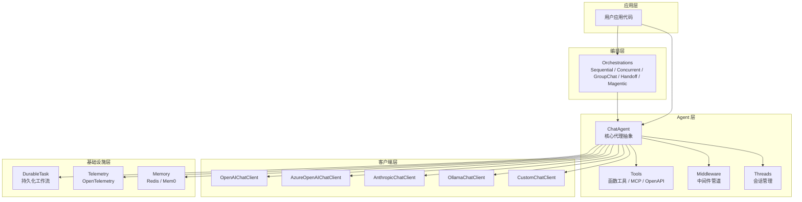
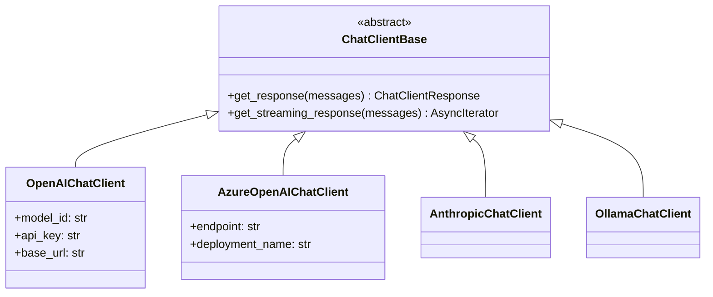
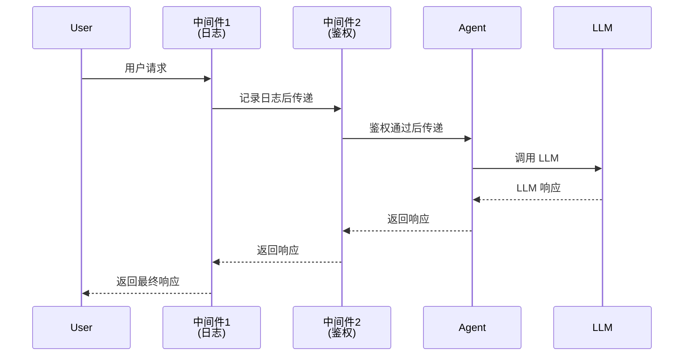
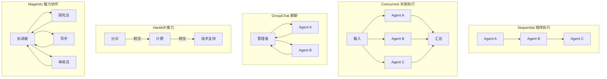
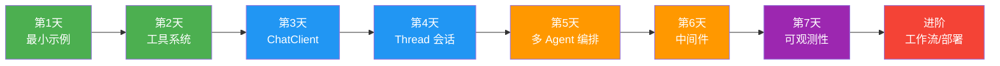

# Microsoft Agent Framework 学习文档

> 📅 最后更新：2026年2月9日
>
> 本文档是对整个 agent-framework 项目的系统性学习指南，面向希望深入理解和使用该框架的开发者。

---

## 📑 目录

1. [项目概览](#1-项目概览)
2. [架构设计与核心理念](#2-架构设计与核心理念)
3. [项目目录结构详解](#3-项目目录结构详解)
4. [开发环境搭建](#4-开发环境搭建)
5. [核心概念深度解析](#5-核心概念深度解析)
6. [入门实战：从零创建一个Agent](#6-入门实战从零创建一个agent)
7. [进阶功能](#7-进阶功能)
8. [第三方模型适配（以腾讯云混元为例）](#8-第三方模型适配以腾讯云混元为例)
9. [测试与代码质量](#9-测试与代码质量)
10. [示例索引与学习路径](#10-示例索引与学习路径)
11. [架构决策记录（ADR）导读](#11-架构决策记录adr导读)
12. [常见问题与排坑指南](#12-常见问题与排坑指南)
13. [参考资源](#13-参考资源)

---

## 1. 项目概览

### 1.1 什么是 Agent Framework？

**Microsoft Agent Framework** 是微软推出的一个现代化 AI 代理开发框架，用于构建、编排和部署 AI 代理（Agent）。它支持 Python 和 .NET 双语言栈，提供从简单聊天代理到复杂多代理工作流的全方位能力。

> 💡 **类比理解**：如果 LLM（大语言模型）是一个"大脑"，那 Agent Framework 就是帮你把这个"大脑"装进一个"机器人"里的工具箱——它负责手、脚、眼睛（工具调用、工作流、可观测性）等一切让"大脑"能真正干活的外围系统。

### 1.2 核心特性一览

| 特性 | 说明 |
|------|------|
| **多语言支持** | Python 3.10+ 和 .NET 6.0+ 双栈实现 |
| **多 AI 提供商** | OpenAI、Azure OpenAI、Anthropic、Ollama、AWS Bedrock 等 |
| **工具系统（Tools）** | 函数工具、MCP 协议、OpenAPI 集成 |
| **多 Agent 编排** | Sequential、Concurrent、Group Chat、Handoff、Magentic 五种模式 |
| **工作流引擎** | 基于 Durable Task Framework 的持久化工作流 |
| **可观测性** | 内建 OpenTelemetry 集成，分布式追踪 |
| **中间件系统** | 灵活的请求/响应处理管道 |
| **声明式 Agent** | 通过 YAML 配置文件定义 Agent |
| **开发者 UI** | DevUI 交互式调试和测试界面 |

### 1.3 与同类框架的关系

```
                    ┌─────────────────────────┐
                    │   Microsoft Agent       │
                    │   Framework             │
                    │ (本项目，2025年发布)      │
                    └───────┬─────────────────┘
                            │ 继承 / 演进
              ┌─────────────┼─────────────────┐
              │                               │
    ┌─────────▼──────────┐       ┌────────────▼──────────┐
    │  Semantic Kernel   │       │    AutoGen            │
    │  (微软早期AI框架)   │       │  (微软多Agent框架)     │
    └────────────────────┘       └───────────────────────┘
```

框架提供了从 Semantic Kernel 和 AutoGen 的**迁移指南**，位于：
- `python/samples/autogen-migration/`
- `python/samples/semantic-kernel-migration/`

---

## 2. 架构设计与核心理念

### 2.1 分层架构



### 2.2 设计原则

1. **模块化**：22 个独立 Python 包，按功能高度解耦，按需安装
2. **可插拔**：Chat Client 接口统一抽象，轻松切换 AI 提供商
3. **OpenAI 兼容**：核心使用 OpenAI SDK 标准协议，天然支持兼容接口
4. **异步优先**：全面基于 `asyncio`，高性能异步处理
5. **类型安全**：全面的 Type Hints + Pydantic 数据校验

---

## 3. 项目目录结构详解

```
agent-framework/
├── python/                          # Python 实现（本文档主要关注）
│   ├── packages/                    # 22 个功能模块包
│   │   ├── core/                    # 🔑 核心包（agent_framework）
│   │   ├── orchestrations/          # 多 Agent 编排
│   │   ├── durabletask/             # 持久化工作流引擎
│   │   ├── declarative/             # 声明式 Agent（YAML 驱动）
│   │   ├── azure-ai/               # Azure AI 集成
│   │   ├── anthropic/              # Anthropic Claude 支持
│   │   ├── ollama/                 # 本地 Ollama 模型
│   │   ├── bedrock/                # AWS Bedrock 支持
│   │   ├── claude/                 # Claude 模型专用
│   │   ├── a2a/                    # Agent-to-Agent 协议
│   │   ├── ag-ui/                  # AG UI 框架
│   │   ├── devui/                  # 开发者调试 UI
│   │   ├── chatkit/                # Chat UI 组件
│   │   ├── redis/                  # Redis 存储支持
│   │   ├── mem0/                   # Mem0 内存管理
│   │   ├── azure-ai-search/        # Azure AI 搜索集成
│   │   ├── azurefunctions/         # Azure Functions 部署
│   │   ├── copilotstudio/          # Copilot Studio 集成
│   │   ├── github_copilot/         # GitHub Copilot 集成
│   │   ├── foundry_local/          # Foundry 本地运行
│   │   ├── purview/                # Purview 合规审计
│   │   └── lab/                    # 实验性功能（benchmarking 等）
│   ├── samples/                     # 📚 丰富的示例代码
│   │   ├── getting_started/         # 入门示例
│   │   │   ├── minimal_sample.py    # 最小示例
│   │   │   ├── agents/              # 各种 Agent Provider 示例
│   │   │   ├── tools/               # 工具使用示例
│   │   │   ├── orchestrations/      # 编排模式示例
│   │   │   ├── workflows/           # 工作流示例
│   │   │   ├── middleware/          # 中间件示例
│   │   │   ├── observability/       # 可观测性示例
│   │   │   ├── threads/             # 会话管理示例
│   │   │   ├── chat_client/         # 直接使用 ChatClient 示例
│   │   │   ├── declarative/         # 声明式 Agent 示例
│   │   │   ├── mcp/                 # MCP 协议示例
│   │   │   ├── devui/               # DevUI 示例
│   │   │   ├── multimodal_input/    # 多模态输入示例
│   │   │   ├── durabletask/         # 持久化任务示例
│   │   │   ├── azure_functions/     # Azure Functions 部署示例
│   │   │   ├── context_providers/   # 上下文提供者示例
│   │   │   └── evaluation/          # 评估和红队测试
│   │   ├── autogen-migration/       # AutoGen 迁移示例
│   │   ├── semantic-kernel-migration/ # Semantic Kernel 迁移示例
│   │   ├── concepts/               # 概念性示例
│   │   └── demos/                   # 完整演示项目
│   ├── tests/                       # 测试代码
│   ├── pyproject.toml               # 项目配置（workspace 模式）
│   └── DEV_SETUP.md                 # 开发环境搭建文档
├── dotnet/                          # .NET 实现
│   ├── src/                         # 核心源代码
│   ├── samples/                     # .NET 示例
│   └── tests/                       # 测试
├── docs/                            # 设计文档和架构决策
│   ├── decisions/                   # 架构决策记录（ADR）
│   ├── design/                      # 设计文档
│   ├── features/                    # 功能规格
│   └── specs/                       # 技术规格
├── agent-samples/                   # Agent 配置 YAML 示例
├── workflow-samples/                # 工作流 YAML 示例
├── schemas/                         # JSON Schema 定义
└── _mydocs/                         # 自定义学习文档（本文档所在目录）
```

### 3.1 核心包（core）内部结构

`packages/core/agent_framework/` 是整个框架的核心，其 `__init__.py` 导出了所有核心模块：

| 模块 | 导出来源 | 功能 |
|------|----------|------|
| `_agents` | Agents 抽象和实现 | `ChatAgent`、`AgentResponse` 等 |
| `_clients` | Chat Client 抽象 | `ChatClientBase` 等 |
| `_tools` | 工具系统 | `@tool` 装饰器、`FunctionTool` 等 |
| `_types` | 类型定义 | `ChatMessage`、`Role` 等 |
| `_threads` | 会话管理 | Thread 管理和消息存储 |
| `_middleware` | 中间件系统 | 中间件管道和处理器 |
| `_workflows` | 工作流引擎 | Workflow 定义和执行 |
| `_memory` | 记忆管理 | 上下文提供者 |
| `_mcp` | MCP 协议 | Model Context Protocol 支持 |
| `_telemetry` | 可观测性 | OpenTelemetry 集成 |
| `_logging` | 日志系统 | 统一日志配置 |

---

## 4. 开发环境搭建

### 4.1 前置条件

- Python 3.10+（推荐 3.11 或 3.12）
- [uv](https://github.com/astral-sh/uv) - 现代 Python 包管理器
- Git

### 4.2 安装步骤

```bash
# 1. 安装 uv（macOS/Linux）
curl -LsSf https://astral.sh/uv/install.sh | sh
# 或 macOS 用 Homebrew
brew install uv

# 2. 克隆项目
git clone https://github.com/microsoft/agent-framework.git
cd agent-framework/python

# 3. 创建虚拟环境并安装依赖
uv sync --all-packages --all-extras --dev

# 4.（可选）完整的开发环境设置（含 pre-commit hooks）
uv run poe setup
```

### 4.3 IDE 配置（VSCode）

1. 用 VSCode 打开 `python/` 目录作为工作区根目录
2. 安装 Python 扩展
3. 按 `Ctrl+Shift+P` → `Python: Select Interpreter` → 选择 `.venv` 中的解释器
4. VSCode 会自动从 `.env` 文件加载环境变量

### 4.4 API 密钥配置

创建 `.env` 文件（项目根目录或 samples 目录下）：

```env
# OpenAI 配置
OPENAI_API_KEY=sk-...
OPENAI_CHAT_MODEL_ID=gpt-4o-mini

# Azure OpenAI 配置
AZURE_OPENAI_API_KEY=...
AZURE_OPENAI_ENDPOINT=https://your-resource.openai.azure.com
AZURE_OPENAI_CHAT_DEPLOYMENT_NAME=gpt-4o-mini

# 腾讯云混元配置（如使用第三方兼容服务）
TENCENT_HUNYUAN_API_KEY=sk-...
TENCENT_HUNYUAN_BASE_URL=https://api.hunyuan.cloud.tencent.com/v1
```

> ⚠️ **安全提示**：始终将 `.env` 添加到 `.gitignore`，永远不要把密钥提交到代码仓库。

---

## 5. 核心概念深度解析

### 5.1 ChatClient（聊天客户端）

ChatClient 是与 LLM 通信的底层抽象，负责发送消息和接收响应。每个 AI 提供商都有对应的实现。



**直接使用 ChatClient（不经过 Agent）：**

```python
import asyncio
from agent_framework import ChatMessage
from agent_framework.openai import OpenAIChatClient

async def main():
    client = OpenAIChatClient()
    messages = [
        ChatMessage("system", ["你是一个有帮助的助手。"]),
        ChatMessage("user", ["写一首关于Python的俳句。"])
    ]
    response = await client.get_response(messages)
    print(response.messages[0].text)

asyncio.run(main())
```

### 5.2 Agent（代理）

Agent 是 ChatClient 之上的高级抽象，封装了指令（instructions）、工具（tools）和会话管理。

```python
from agent_framework import ChatAgent
from agent_framework.openai import OpenAIChatClient

# 方式一：使用 ChatAgent 类
agent = ChatAgent(
    chat_client=OpenAIChatClient(),
    name="MyAgent",
    instructions="你是一个乐于助人的AI助手。",
    tools=[my_tool_function]
)

# 方式二：使用 as_agent() 快捷方法
agent = OpenAIChatClient().as_agent(
    name="MyAgent",
    instructions="你是一个乐于助人的AI助手。",
    tools=[my_tool_function]
)

# 运行 Agent
result = await agent.run("你好，请帮我查一下天气。")
```

### 5.3 Tool（工具）

工具是 Agent 与外部世界交互的桥梁——让 LLM 不仅能"说"，还能"做"。

> 💡 **类比理解**：工具就像给 Agent 配了"手臂"。LLM 本身只能思考和输出文字，有了工具，它就能查天气、查数据库、调 API，真正解决问题。

**三种工具定义方式：**

```python
# 方式一：@tool 装饰器（推荐）
from agent_framework import tool
from typing import Annotated

@tool(approval_mode="never_require")
def get_weather(
    location: Annotated[str, "要查询天气的地点"],
) -> str:
    """获取指定地点的天气信息。"""
    return f"{location}的天气：晴朗，25°C"

# 方式二：普通函数（框架自动推断 schema）
def get_menu_specials() -> str:
    """获取今日菜单特色。"""
    return "今日特色：红烧肉"

# 方式三：类方法（有状态的工具）
class WeatherService:
    def __init__(self, api_key: str):
        self.api_key = api_key

    def query(self, location: Annotated[str, "地点"]) -> str:
        """查询天气。"""
        return f"使用API查询{location}的天气..."

service = WeatherService(api_key="...")
agent = client.as_agent(tools=service.query)
```

**工具的关键配置：**

| 参数 | 说明 | 默认值 |
|------|------|--------|
| `approval_mode` | 执行前是否需要用户批准 | `"always_require"` |
| `max_invocations` | 最大调用次数限制 | 无限制 |
| `max_invocation_exceptions` | 最大允许失败次数 | 无限制 |

### 5.4 Thread（会话线程）

Thread 管理多轮对话的上下文。每个 Thread 自动存储和检索对话历史。

```python
# 使用 Thread 进行多轮对话
thread = await agent.create_thread()
response1 = await agent.run("我叫小明", thread=thread)
response2 = await agent.run("我叫什么名字？", thread=thread)
# Agent 记得你叫小明！
```

### 5.5 Middleware（中间件）

中间件系统允许你在请求/响应管道中插入自定义处理逻辑。



**三种中间件实现方式：**

1. **函数式中间件**：最简单的方式
2. **装饰器中间件**：用装饰器语法定义
3. **类式中间件**：适合复杂场景

```python
# 函数式中间件示例
async def logging_middleware(context, next_handler):
    print(f"请求开始: {context.messages[-1].text}")
    response = await next_handler(context)
    print(f"响应完成: {response.messages[0].text}")
    return response
```

### 5.6 Orchestration（编排）

编排是将多个 Agent 组合协作的机制，框架提供五种内置编排模式：



| 模式 | 适用场景 | Builder 类 |
|------|----------|-----------|
| **Sequential** | 流水线处理，任务有先后依赖 | `SequentialBuilder` |
| **Concurrent** | 独立子任务并行执行，然后汇总 | `ConcurrentBuilder` |
| **GroupChat** | 多角色讨论，由管理者选择发言者 | `GroupChatBuilder` |
| **Handoff** | Agent 之间自主路由和交接 | `HandoffBuilder` |
| **Magentic** | 复杂协作，协调者动态分配子任务 | `MagenticBuilder` |

```python
from agent_framework_orchestrations import SequentialBuilder

# 顺序编排示例
workflow = SequentialBuilder().participants([writer, reviewer, editor]).build()
result = await workflow.run("写一篇关于AI的文章")
```

---

## 6. 入门实战：从零创建一个 Agent

### 6.1 最小示例

```python
"""最小的 Agent Framework 示例"""
import asyncio
from agent_framework.openai import OpenAIChatClient

async def main():
    agent = OpenAIChatClient(
        api_key="your-api-key",
    ).as_agent(
        name="HelloAgent",
        instructions="你是一个友善的中文助手。",
    )
    result = await agent.run("你好！请自我介绍一下。")
    print(result)

asyncio.run(main())
```

### 6.2 带工具的 Agent

```python
"""带天气查询工具的 Agent"""
import asyncio
from typing import Annotated
from random import randint
from agent_framework import tool
from agent_framework.openai import OpenAIChatClient

@tool(approval_mode="never_require")
def get_weather(
    location: Annotated[str, "要查询的城市名"],
) -> str:
    """查询指定城市的天气。"""
    conditions = ["晴天", "多云", "小雨", "暴风雨"]
    return f"{location}的天气：{conditions[randint(0, 3)]}，气温{randint(15, 35)}°C"

async def main():
    agent = OpenAIChatClient(api_key="your-api-key").as_agent(
        name="WeatherAgent",
        instructions="你是一个天气查询助手，可以使用工具查询天气。",
        tools=get_weather,
    )
    result = await agent.run("深圳今天天气怎么样？")
    print(result)

asyncio.run(main())
```

### 6.3 多 Agent 协作示例

```python
"""Writer + Reviewer 协作示例"""
import asyncio
from agent_framework import ChatAgent
from agent_framework.openai import OpenAIChatClient

async def main():
    writer = ChatAgent(
        chat_client=OpenAIChatClient(),
        name="Writer",
        instructions="你是一个创意文案写手。"
    )

    reviewer = ChatAgent(
        chat_client=OpenAIChatClient(),
        name="Reviewer",
        instructions="你是一个严格的文案审核员，提供改进建议。"
    )

    # 第一步：写手写初稿
    draft = await writer.run("写一句电动汽车广告语")
    print(f"初稿：{draft}")

    # 第二步：审核员提建议
    feedback = await reviewer.run(f"请审核这句广告语：{draft}")
    print(f"审核意见：{feedback}")

    # 第三步：写手根据建议修改
    final = await writer.run(f"根据以下建议修改广告语：\n原稿：{draft}\n建议：{feedback}")
    print(f"终稿：{final}")

asyncio.run(main())
```

---

## 7. 进阶功能

### 7.1 声明式 Agent（YAML 驱动）

通过 YAML 文件定义 Agent，无需写大量 Python 代码：

```yaml
# agent.yaml
type: openai_responses
name: WeatherBot
instructions: "你是一个天气查询助手。"
model: gpt-4o-mini
tools:
  - type: function
    name: get_weather
```

```python
from agent_framework_declarative import DeclarativeAgentLoader

agent = DeclarativeAgentLoader.load_from_file("agent.yaml")
result = await agent.run("今天天气如何？")
```

### 7.2 持久化工作流（Durable Task）

使用 Durable Task 框架实现可靠的、支持断点续传的工作流：

| 能力 | 说明 |
|------|------|
| 检查点恢复 | 工作流中断后可从上次断点继续 |
| 时间旅行 | 可以回放和重新执行历史步骤 |
| Human-in-the-Loop | 支持人工审批和干预 |
| 流式传输 | 支持 Redis Streams 可靠流式 |

### 7.3 MCP（Model Context Protocol）集成

MCP 是一种标准化协议，让 Agent 可以连接外部工具和数据源：

```python
# Agent 作为 MCP 服务端
from agent_framework._mcp import MCPServer

# Agent 连接 MCP 工具
agent = client.as_agent(
    tools=[mcp_tool],  # MCP 工具自动注册
)
```

### 7.4 可观测性（OpenTelemetry）

框架内建完整的 OpenTelemetry 集成，支持分布式追踪和监控：

```python
# 零配置可观测性
from agent_framework import configure_telemetry

configure_telemetry(
    service_name="my-agent-app",
    endpoint="http://localhost:4317",  # OTLP 端点
)
```

### 7.5 上下文提供者（Context Providers）

通过上下文提供者为 Agent 注入额外知识：

| 提供者 | 说明 |
|--------|------|
| `SimpleContextProvider` | 简单的静态上下文 |
| `RedisContextProvider` | Redis 存储的对话上下文 |
| `Mem0ContextProvider` | Mem0 长期记忆 |
| `AzureAISearchProvider` | Azure AI 搜索（RAG） |
| `AggregateContextProvider` | 组合多个提供者 |

---

## 8. 第三方模型适配（以腾讯云混元为例）

### 8.1 适配原理

Agent Framework 的 `OpenAIChatClient` 支持 `base_url` 参数，任何兼容 OpenAI API 规范的第三方服务都可以无缝接入——只需修改三个参数：

```python
OpenAIChatClient(
    model_id="模型名称",        # 第三方模型名
    api_key="API密钥",          # 第三方API密钥
    base_url="API端点URL",      # 第三方API地址
)
```

### 8.2 腾讯云混元适配实战

```python
import asyncio
import os
from dotenv import load_dotenv
from agent_framework import tool
from agent_framework.openai import OpenAIChatClient

# 加载 .env 配置（override=True 确保覆盖已有环境变量）
load_dotenv(os.path.join(os.path.dirname(__file__), '.env'), override=True)

# 腾讯云混元配置
HUNYUAN_BASE_URL = "https://api.hunyuan.cloud.tencent.com/v1"
HUNYUAN_MODEL = "hunyuan-2.0-instruct-20251111"

@tool(approval_mode="never_require")
def get_weather(location: str) -> str:
    """查询天气。"""
    return f"{location}：晴天，25°C"

agent = OpenAIChatClient(
    model_id=HUNYUAN_MODEL,
    api_key=os.getenv("TENCENT_HUNYUAN_API_KEY"),
    base_url=HUNYUAN_BASE_URL,
).as_agent(
    name="WeatherAgent",
    instructions="你是一个天气查询助手。",
    tools=get_weather,
)

asyncio.run(agent.run("深圳天气如何？"))
```

### 8.3 适配注意事项

| 注意点 | 说明 |
|--------|------|
| `base_url` 格式 | 必须以 `/v1` 结尾，不含 `/chat/completions` |
| `load_dotenv(override=True)` | 多个 `.env` 文件时，确保正确的密钥优先 |
| `model_id` | 使用第三方服务提供的完整模型名称 |
| 功能兼容性 | 部分高级功能（如 Code Interpreter）可能不被第三方支持 |

---

## 9. 测试与代码质量

### 9.1 工具链一览

| 工具 | 用途 | 命令 |
|------|------|------|
| **pytest** | 单元测试 | `uv run poe test` |
| **ruff** | 代码格式化和 lint | `uv run poe fmt` / `uv run poe lint` |
| **pyright** | 类型检查 | `uv run poe pyright` |
| **mypy** | 静态类型检查 | `uv run poe mypy` |
| **pre-commit** | Git 钩子 | `uv run poe pre-commit-install` |

### 9.2 常用命令

```bash
# 运行所有检查（格式化 + lint + 类型检查 + 测试）
uv run poe check

# 运行特定包的测试
uv run poe --directory packages/core test

# 并行运行所有测试（更快）
uv run poe all-tests

# 带覆盖率的测试
uv run poe all-tests-cov

# 代码格式化
uv run poe fmt

# 构建所有包
uv run poe build
```

### 9.3 集成测试

标记有 `@skip_if_..._integration_tests_disabled` 的测试需要外部服务。运行方式：

```bash
# 设置环境变量启用集成测试
export RUN_INTEGRATION_TESTS=true
# 确保相应的 API 密钥已配置
uv run poe test
```

---

## 10. 示例索引与学习路径

### 10.1 推荐学习路径



### 10.2 分阶段学习索引

#### 🟢 入门阶段

| 主题 | 示例文件 | 说明 |
|------|----------|------|
| 最小示例 | `getting_started/minimal_sample.py` | 一个文件搞定基础 Agent |
| 基础 Agent | `getting_started/agents/openai/openai_chat_client_basic.py` | 使用 OpenAI 创建 Agent |
| 函数工具 | `getting_started/tools/function_tool_declaration_only.py` | 工具声明和使用 |
| 直接使用 Client | `getting_started/chat_client/openai_chat_client.py` | 不经过 Agent 直接调用 |

#### 🔵 进阶阶段

| 主题 | 示例文件 | 说明 |
|------|----------|------|
| 工具审批 | `getting_started/tools/function_tool_with_approval.py` | 用户审批工作流 |
| 有状态工具 | `getting_started/tools/tool_in_class.py` | 类方法作为工具 |
| 会话管理 | `getting_started/threads/custom_chat_message_store_thread.py` | Thread 和多轮对话 |
| 中间件 | `getting_started/middleware/decorator_middleware.py` | 装饰器中间件 |
| 上下文提供者 | `getting_started/context_providers/simple_context_provider.py` | 注入额外上下文 |

#### 🟠 高级阶段

| 主题 | 示例文件 | 说明 |
|------|----------|------|
| 顺序编排 | `getting_started/orchestrations/sequential_agents.py` | 多 Agent 流水线 |
| 并发编排 | `getting_started/orchestrations/concurrent_agents.py` | 并行 Agent |
| 群聊编排 | `getting_started/orchestrations/group_chat_simple_selector.py` | 群聊模式 |
| Handoff 编排 | `getting_started/orchestrations/handoff_simple.py` | Agent 交接 |
| Magentic 编排 | `getting_started/orchestrations/magentic.py` | 复杂协作 |
| 多模态输入 | `getting_started/multimodal_input/openai_chat_multimodal.py` | 图片输入 |
| MCP 集成 | `getting_started/mcp/agent_as_mcp_server.py` | MCP 协议 |

#### 🔴 生产部署

| 主题 | 示例文件 | 说明 |
|------|----------|------|
| Durable Agent | `getting_started/durabletask/01_single_agent/` | 持久化 Agent |
| Azure Functions | `getting_started/azure_functions/01_single_agent/` | 云部署 |
| 可观测性 | `getting_started/observability/agent_observability.py` | 监控追踪 |
| 声明式 Agent | `getting_started/declarative/get_weather_agent.py` | YAML 驱动 |
| DevUI | `getting_started/devui/in_memory_mode.py` | 交互式调试 |
| 红队评估 | `getting_started/evaluation/red_teaming/red_team_agent_sample.py` | 安全评估 |

---

## 11. 架构决策记录（ADR）导读

项目在 `docs/decisions/` 中维护了详细的架构决策记录（Architecture Decision Records），是深入理解框架设计思路的宝贵资料：

| ADR | 主题 | 核心内容 |
|-----|------|----------|
| 0001 | Agent Run Response | 定义了 Agent 运行结果的标准格式 |
| 0002 | Agent Tools | 工具系统的设计决策和实现方案 |
| 0003 | OpenTelemetry | 可观测性集成策略 |
| 0005 | Python 命名规范 | Python 代码的命名约定 |
| 0006 | User Approval | 用户审批机制的设计 |
| 0007 | Agent Filtering Middleware | 中间件和过滤器系统设计 |
| 0008 | Python Subpackages | 子包拆分策略 |
| 0009 | Long Running Operations | 长时间运行操作的支持方案 |
| 0010 | AG-UI Support | AG UI 协议支持 |
| 0012 | TypedDict Options | 配置选项的类型设计 |

---

## 12. 常见问题与排坑指南

### Q1：`uv sync` 安装失败，提示版本不存在

**原因**：某些子包依赖了预发布（beta）版本的第三方库，该版本可能尚未发布到 PyPI。

**解决**：在对应子包的 `pyproject.toml` 中放宽版本约束，例如将 `== 1.2.0b5` 改为 `>= 1.1.0`。

### Q2：`ModuleNotFoundError: No module named 'agent_framework'`

**原因**：没有激活正确的虚拟环境。

**解决**：
```bash
# 使用项目虚拟环境运行
.venv/bin/python your_script.py

# 或先激活虚拟环境
source .venv/bin/activate
python your_script.py
```

### Q3：API 密钥显示为占位符，但 `.env` 文件中是正确的

**原因**：`load_dotenv()` 默认 `override=False`，不会覆盖已存在的环境变量。如果项目根目录的 `.env` 先被加载且包含占位符，正确的密钥就会被忽略。

**解决**：使用 `load_dotenv(path, override=True)` 强制覆盖：
```python
load_dotenv(os.path.join(os.path.dirname(__file__), '.env'), override=True)
```

### Q4：使用第三方兼容服务返回 404 错误

**原因**：`base_url` 配置错误。

**解决**：确保 `base_url` 格式正确，以 `/v1` 结尾。例如腾讯云混元的正确地址是 `https://api.hunyuan.cloud.tencent.com/v1`，而不是 `https://hunyuan.cloud.tencent.com/v1`。

### Q5：IDE 中显示 `Unresolved reference` 但代码能正常运行

**原因**：IDE 没有正确识别 workspace 模式的包结构。

**解决**：
1. 确认 VSCode 打开的是 `python/` 目录
2. 选择正确的 Python 解释器（`.venv` 中的）
3. 重启 IDE

---

## 13. 参考资源

### 官方资源

| 资源 | 链接 |
|------|------|
| GitHub 仓库 | https://github.com/microsoft/agent-framework |
| 官方文档 | https://learn.microsoft.com/agent-framework/ |
| PyPI 包 | https://pypi.org/project/agent-framework/ |
| Discord 社区 | https://discord.gg/b5zjErwbQM |
| 介绍视频（30分钟） | https://www.youtube.com/watch?v=AAgdMhftj8w |
| DevUI 演示（1分钟） | https://www.youtube.com/watch?v=mOAaGY4WPvc |

### 项目内文档

| 文档 | 路径 | 说明 |
|------|------|------|
| 主 README | `README.md` | 项目总览和快速入门 |
| Python README | `python/README.md` | Python SDK 详细文档 |
| 开发环境搭建 | `python/DEV_SETUP.md` | 完整的开发环境配置指南 |
| 编码规范 | `python/CODING_STANDARD.md` | Python 代码规范 |
| 变更日志 | `python/CHANGELOG.md` | 版本更新历史 |
| 贡献指南 | `CONTRIBUTING.md` | 如何参与项目贡献 |
| 架构决策 | `docs/decisions/` | 详细的架构设计决策 |
| 设计文档 | `docs/design/` | 技术设计文档 |
| 示例指南 | `python/samples/SAMPLE_GUIDELINES.md` | 编写示例的规范 |

### 相关技术

| 技术 | 说明 |
|------|------|
| [OpenAI API](https://platform.openai.com/docs) | Agent Framework 核心协议基础 |
| [OpenTelemetry](https://opentelemetry.io/) | 可观测性标准 |
| [Durable Task Framework](https://github.com/microsoft/durabletask-python) | 持久化工作流引擎 |
| [MCP Protocol](https://modelcontextprotocol.io/) | Model Context Protocol 标准 |
| [Pydantic](https://docs.pydantic.dev/) | 数据校验和序列化 |
| [uv](https://docs.astral.sh/uv/) | 现代 Python 包管理器 |

---

> 📖 **学习建议**：建议按照第 10 章的学习路径，从入门阶段开始，每天花 1-2 小时阅读和运行示例代码。遇到不理解的概念时，回到第 5 章查阅对应的概念解析。当你对基础概念熟悉后，再进入进阶和高级阶段的学习。
>
> 🎯 **实践为王**：每学完一个概念，尝试修改示例代码，加入自己的想法和需求。例如把 Weather Agent 改成 Stock Agent，或者把 Sequential 编排改成处理自己业务的多 Agent 协作流程。

*Happy coding! 🚀*
