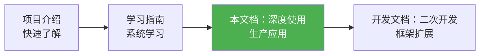
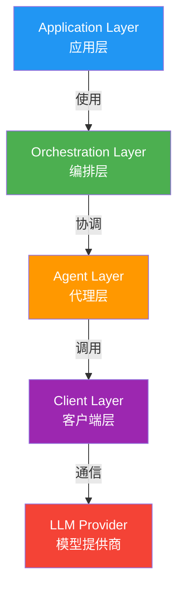

# Microsoft Agent Framework 深度使用指南

> 📅 最后更新：2026年2月26日
>
> 本文档面向希望深度使用 Microsoft Agent Framework 构建生产级 AI 应用的开发者。涵盖高级功能、最佳实践、性能优化和企业级部署。

---

## 📑 目录

1. [文档定位](#1-文档定位)
2. [架构深度解析](#2-架构深度解析)
3. [高级功能实战](#3-高级功能实战)
4. [多Agent编排进阶](#4-多agent编排进阶)
5. [工作流系统深度应用](#5-工作流系统深度应用)
6. [持久化与状态管理](#6-持久化与状态管理)
7. [可观测性与监控](#7-可观测性与监控)
8. [性能优化实践](#8-性能优化实践)
9. [安全与权限管理](#9-安全与权限管理)
10. [生产环境部署](#10-生产环境部署)
11. [错误处理与容错](#11-错误处理与容错)
12. [测试与质量保证](#12-测试与质量保证)
13. [高级集成场景](#13-高级集成场景)
14. [性能基准与调优](#14-性能基准与调优)
15. [常见问题与最佳实践](#15-常见问题与最佳实践)

---

## 1. 文档定位

### 1.1 与其他文档的关系



### 1.2 适用读者

- **已完成基础学习**：熟悉 Agent、Tool、Thread 等核心概念
- **准备构建生产应用**：需要了解企业级特性和最佳实践
- **性能敏感场景**：对延迟、吞吐量有具体要求
- **复杂业务场景**：需要多Agent协作、工作流编排、状态管理

### 1.3 前置知识

- Python 3.10+ 异步编程（`asyncio`、`await`/`async`）
- 基础 LLM 概念（prompt、token、temperature）
- RESTful API 和 HTTP 协议
- 基础数据库和缓存概念（Redis、SQLite）

---

## 2. 架构深度解析

### 2.1 核心抽象层次

Agent Framework 采用分层架构，每层负责不同的职责：



#### 关键设计原则

| 原则 | 说明 | 示例 |
|------|------|------|
| **依赖倒置** | 上层依赖抽象，不依赖具体实现 | `ChatAgent` 依赖 `ChatClientBase`，不依赖 `OpenAIChatClient` |
| **开闭原则** | 对扩展开放，对修改封闭 | 通过中间件系统扩展功能，无需修改核心代码 |
| **单一职责** | 每个组件只负责一件事 | `ChatClient` 只负责与 LLM 通信，`Agent` 负责编排 |
| **异步优先** | 全面基于 `asyncio` | 所有 IO 操作都是异步的，支持高并发 |

### 2.2 数据流分析

#### 典型请求流程

```python
# 1. 用户发起请求
user_input = "北京今天天气如何？"

# 2. Agent 接收并构建上下文
messages = [
    ChatMessage("system", [agent.instructions]),
    ChatMessage("user", [user_input])
]

# 3. 中间件管道处理（可选）
# - 日志记录
# - 鉴权验证
# - 上下文注入

# 4. ChatClient 调用 LLM
response = await client.get_response(messages)

# 5. 工具调用（如需要）
if response.tool_calls:
    tool_results = await execute_tools(response.tool_calls)
    # 递归调用，将工具结果反馈给 LLM
    
# 6. 返回最终响应
return response.messages[0].text
```

### 2.3 内存模型

Agent Framework 提供多种内存管理策略：

```python
from agent_framework import ChatAgent
from agent_framework.openai import OpenAIChatClient
from agent_framework_redis import RedisChatMessageStore

# 1. 内存存储（默认，会话结束即清空）
agent = ChatAgent(chat_client=OpenAIChatClient())

# 2. 持久化到 Redis（生产推荐）
message_store = RedisChatMessageStore(
    redis_url="redis://localhost:6379",
    ttl=86400  # 24小时过期
)
agent = ChatAgent(
    chat_client=OpenAIChatClient(),
    message_store=message_store
)

# 3. 自定义存储（如数据库）
class DatabaseMessageStore(ChatMessageStore):
    async def add_messages(self, thread_id: str, messages: list[ChatMessage]):
        # 实现数据库存储逻辑
        pass
```

---

## 3. 高级功能实战

### 3.1 工具系统深度应用

#### 3.1.1 有状态工具

工具可以携带状态，用于管理复杂业务逻辑：

```python
from typing import Annotated
from agent_framework import tool

class CustomerService:
    def __init__(self, db_connection):
        self.db = db_connection
        self.session_context = {}
    
    @tool(approval_mode="never_require")
    def query_order(
        self,
        order_id: Annotated[str, "订单号"],
        user_id: Annotated[str, "用户ID"]
    ) -> str:
        """查询订单信息"""
        # 鉴权检查
        if not self._verify_user_access(user_id, order_id):
            return "权限不足"
        
        # 查询数据库
        order = self.db.query(f"SELECT * FROM orders WHERE id={order_id}")
        
        # 缓存到会话上下文
        self.session_context[user_id] = {"last_order": order}
        
        return f"订单 {order_id}: 状态 {order['status']}"
    
    def _verify_user_access(self, user_id, order_id):
        # 实现鉴权逻辑
        return True

# 使用
service = CustomerService(db_connection=my_db)
agent = client.as_agent(tools=[service.query_order])
```

#### 3.1.2 工具链（Tool Chaining）

多个工具协作完成复杂任务：

```python
@tool(approval_mode="never_require")
def search_products(keyword: str) -> list[dict]:
    """搜索商品"""
    return [
        {"id": 1, "name": "iPhone 15", "price": 5999},
        {"id": 2, "name": "iPhone 15 Pro", "price": 7999}
    ]

@tool(approval_mode="never_require")
def get_product_details(product_id: int) -> dict:
    """获取商品详情"""
    return {
        "id": product_id,
        "name": "iPhone 15",
        "specs": {"memory": "128GB", "color": "黑色"},
        "stock": 50
    }

@tool(approval_mode="always_require")
def create_order(product_id: int, quantity: int) -> str:
    """创建订单（需要用户确认）"""
    return f"订单创建成功，订单号: {generate_order_id()}"

# Agent 会自动按需调用工具链
agent = client.as_agent(
    tools=[search_products, get_product_details, create_order],
    instructions="你是购物助手，帮助用户搜索商品并下单。"
)

# 用户："我想买一部iPhone"
# Agent 自动执行：search_products → get_product_details → create_order
```

#### 3.1.3 工具审批流程

生产环境中，敏感操作需要人工审批：

```python
from agent_framework import tool, ApprovalResult

@tool(approval_mode="always_require")
async def transfer_money(
    from_account: str,
    to_account: str,
    amount: float
) -> str:
    """转账（需人工审批）"""
    return f"已转账 {amount} 元从 {from_account} 到 {to_account}"

# 自定义审批处理器
async def custom_approval_handler(tool_call):
    print(f"请求审批: {tool_call.function_name}")
    print(f"参数: {tool_call.arguments}")
    
    # 在生产环境中，这里会调用审批系统 API
    user_input = input("是否批准？(yes/no): ")
    
    if user_input.lower() == "yes":
        return ApprovalResult.APPROVED
    else:
        return ApprovalResult.REJECTED

agent = client.as_agent(
    tools=transfer_money,
    approval_handler=custom_approval_handler
)
```

### 3.2 上下文管理

#### 3.2.1 上下文提供者（Context Providers）

为 Agent 动态注入外部知识：

```python
from agent_framework import SimpleContextProvider, AggregateContextProvider

# 1. 简单静态上下文
static_context = SimpleContextProvider(
    context="公司政策：年假15天，病假30天。"
)

# 2. 动态上下文（从数据库查询）
class DatabaseContextProvider:
    async def get_context(self, thread_id: str) -> str:
        user = await self.db.get_user_by_thread(thread_id)
        return f"用户信息：{user.name}，VIP等级：{user.vip_level}"

# 3. 组合多个上下文
context_provider = AggregateContextProvider([
    static_context,
    DatabaseContextProvider()
])

agent = ChatAgent(
    chat_client=client,
    context_providers=[context_provider]
)
```

#### 3.2.2 RAG（检索增强生成）集成

```python
from agent_framework_azure_ai_search import AzureAISearchContextProvider

# Azure AI Search 作为知识库
search_provider = AzureAISearchContextProvider(
    endpoint=os.getenv("AZURE_SEARCH_ENDPOINT"),
    api_key=os.getenv("AZURE_SEARCH_API_KEY"),
    index_name="company_docs"
)

agent = ChatAgent(
    chat_client=client,
    instructions="你是客服助手，根据公司文档回答问题。",
    context_providers=[search_provider]
)

# 查询时自动检索相关文档
result = await agent.run("公司的退货政策是什么？")
# Agent 会先从 Azure AI Search 检索相关文档，再回答
```

### 3.3 中间件系统

#### 3.3.1 日志中间件

记录所有请求和响应：

```python
import logging
from datetime import datetime

logger = logging.getLogger(__name__)

async def logging_middleware(context, next_handler):
    request_id = str(uuid.uuid4())
    start_time = datetime.now()
    
    logger.info(f"[{request_id}] 请求开始: {context.messages[-1].text[:100]}")
    
    try:
        response = await next_handler(context)
        duration = (datetime.now() - start_time).total_seconds()
        logger.info(f"[{request_id}] 请求完成，耗时 {duration:.2f}s")
        return response
    except Exception as e:
        logger.error(f"[{request_id}] 请求失败: {str(e)}")
        raise
```

#### 3.3.2 性能监控中间件

```python
import time
from prometheus_client import Histogram

request_duration = Histogram(
    'agent_request_duration_seconds',
    'Agent请求处理时长'
)

async def metrics_middleware(context, next_handler):
    with request_duration.time():
        return await next_handler(context)
```

#### 3.3.3 限流中间件

```python
from collections import defaultdict
from datetime import datetime, timedelta

class RateLimiter:
    def __init__(self, max_requests: int, time_window: int):
        self.max_requests = max_requests
        self.time_window = time_window  # 秒
        self.requests = defaultdict(list)
    
    async def __call__(self, context, next_handler):
        user_id = context.metadata.get("user_id")
        now = datetime.now()
        
        # 清理过期记录
        self.requests[user_id] = [
            t for t in self.requests[user_id]
            if now - t < timedelta(seconds=self.time_window)
        ]
        
        # 检查限流
        if len(self.requests[user_id]) >= self.max_requests:
            raise Exception("请求过于频繁，请稍后再试")
        
        self.requests[user_id].append(now)
        return await next_handler(context)

# 使用：每分钟最多10次请求
agent = ChatAgent(
    chat_client=client,
    middleware=[RateLimiter(max_requests=10, time_window=60)]
)
```

---

## 4. 多Agent编排进阶

### 4.1 Sequential（顺序编排）

适用于需要流水线处理的场景：

```python
from agent_framework_orchestrations import SequentialBuilder

# 场景：内容生成流程（构思 → 撰写 → 审核 → 润色）
ideator = ChatAgent(
    chat_client=client,
    name="Ideator",
    instructions="你负责构思内容大纲和要点。"
)

writer = ChatAgent(
    chat_client=client,
    name="Writer",
    instructions="根据大纲撰写详细内容。"
)

reviewer = ChatAgent(
    chat_client=client,
    name="Reviewer",
    instructions="审核内容的准确性和合规性，指出问题。"
)

polisher = ChatAgent(
    chat_client=client,
    name="Polisher",
    instructions="根据审核意见润色内容。"
)

workflow = SequentialBuilder() \
    .participants([ideator, writer, reviewer, polisher]) \
    .build()

result = await workflow.run("写一篇关于AI安全的文章")
```

### 4.2 Concurrent（并发编排）

适用于独立子任务可以并行处理的场景：

```python
from agent_framework_orchestrations import ConcurrentBuilder

# 场景：竞品分析（同时分析多个维度）
product_analyst = ChatAgent(
    chat_client=client,
    name="ProductAnalyst",
    instructions="分析产品功能和特性。"
)

price_analyst = ChatAgent(
    chat_client=client,
    name="PriceAnalyst",
    instructions="分析产品定价策略。"
)

market_analyst = ChatAgent(
    chat_client=client,
    name="MarketAnalyst",
    instructions="分析市场定位和用户群体。"
)

# 自定义聚合器
async def custom_aggregator(results):
    report = "# 竞品分析报告\n\n"
    for result in results:
        report += f"## {result.agent_name}\n{result.content}\n\n"
    return report

workflow = ConcurrentBuilder() \
    .participants([product_analyst, price_analyst, market_analyst]) \
    .aggregator(custom_aggregator) \
    .build()

result = await workflow.run("分析iPhone 15相比Android旗舰的竞争力")
```

### 4.3 GroupChat（群聊模式）

适用于多角色协作讨论的场景：

```python
from agent_framework_orchestrations import GroupChatBuilder

# 场景：产品评审会
pm = ChatAgent(
    chat_client=client,
    name="ProductManager",
    instructions="你是产品经理，关注用户价值和商业目标。"
)

engineer = ChatAgent(
    chat_client=client,
    name="Engineer",
    instructions="你是技术负责人，关注技术可行性和成本。"
)

designer = ChatAgent(
    chat_client=client,
    name="Designer",
    instructions="你是设计师，关注用户体验和交互流程。"
)

# 管理者决定谁发言
manager = ChatAgent(
    chat_client=client,
    name="Manager",
    instructions="""你是项目管理者。根据讨论进度选择下一个发言者。
    选择规则：
    - 先让PM阐述需求
    - 再让Engineer评估可行性
    - 最后让Designer提供设计建议
    - 如果有分歧，让相关方再次发言
    """
)

workflow = GroupChatBuilder() \
    .participants([pm, engineer, designer]) \
    .manager(manager) \
    .max_rounds(10) \
    .build()

result = await workflow.run("评审新功能：用户画像分析")
```

### 4.4 Handoff（接力模式）

适用于客服场景的智能路由：

```python
from agent_framework_orchestrations import HandoffBuilder

# 一线客服（分诊）
triage = ChatAgent(
    chat_client=client,
    name="Triage",
    instructions="""你是一线客服，负责：
    1. 解答简单问题（如营业时间、地址）
    2. 将复杂问题转交给专业客服
    
    转交规则：
    - 技术问题 → TechSupport
    - 账单问题 → Billing
    - 投诉建议 → Complaint
    """,
    handoff_to=["TechSupport", "Billing", "Complaint"]
)

tech_support = ChatAgent(
    chat_client=client,
    name="TechSupport",
    instructions="你是技术支持，解决产品使用问题。"
)

billing = ChatAgent(
    chat_client=client,
    name="Billing",
    instructions="你是财务客服，处理账单和退款。"
)

complaint = ChatAgent(
    chat_client=client,
    name="Complaint",
    instructions="你是投诉处理专员，记录和跟进用户投诉。"
)

workflow = HandoffBuilder() \
    .participants([triage, tech_support, billing, complaint]) \
    .build()

result = await workflow.run("我的产品无法启动，显示错误代码500")
# Agent会自动路由：Triage → TechSupport
```

### 4.5 Magentic（磁力协作）

适用于复杂研究和创作任务：

```python
from agent_framework_orchestrations import MagenticBuilder

# 协调者（类似项目经理）
coordinator = ChatAgent(
    chat_client=client,
    name="Coordinator",
    instructions="""你是协调者，负责：
    1. 将复杂任务拆解为子任务
    2. 分配子任务给合适的专家
    3. 汇总结果，生成最终报告
    """
)

# 专家团队
researcher = ChatAgent(
    chat_client=client,
    name="Researcher",
    instructions="你是研究员，擅长信息检索和事实核查。"
)

analyst = ChatAgent(
    chat_client=client,
    name="Analyst",
    instructions="你是数据分析师，擅长数据分析和可视化。"
)

writer = ChatAgent(
    chat_client=client,
    name="Writer",
    instructions="你是写作专家，擅长撰写专业报告。"
)

workflow = MagenticBuilder() \
    .coordinator(coordinator) \
    .participants([researcher, analyst, writer]) \
    .max_iterations(5) \
    .build()

result = await workflow.run("撰写AI在医疗领域应用的研究报告")
# 协调者会：
# 1. 让 researcher 收集资料
# 2. 让 analyst 分析数据
# 3. 让 writer 撰写报告
# 4. 迭代优化
```

---

## 5. 工作流系统深度应用

### 5.1 声明式工作流（Declarative Workflows）

通过 YAML 定义复杂的多步骤工作流：

```yaml
# workflow.yaml
name: content_pipeline
version: "1.0"

agents:
  - name: writer
    type: openai_chat
    model: gpt-4o
    instructions: "你是内容创作者"
    
  - name: translator
    type: openai_chat
    model: gpt-4o-mini
    instructions: "你是翻译专家"
    
  - name: seo_optimizer
    type: openai_chat
    model: gpt-4o-mini
    instructions: "你是SEO专家"

workflow:
  - step: create_draft
    agent: writer
    input: "${user_input}"
    output: draft
    
  - step: translate
    agent: translator
    input: "将以下内容翻译为英文：${draft}"
    output: translated
    
  - step: optimize_seo
    agent: seo_optimizer
    input: "优化SEO：${translated}"
    output: final_content
    
  - step: return
    value: "${final_content}"
```

```python
from agent_framework_declarative import DeclarativeWorkflowLoader

# 加载工作流
workflow = DeclarativeWorkflowLoader.load_from_file("workflow.yaml")

# 执行
result = await workflow.run("写一篇介绍Python的文章")
```

### 5.2 条件分支工作流

```yaml
workflow:
  - step: analyze_sentiment
    agent: sentiment_analyzer
    input: "${user_input}"
    output: sentiment
    
  - step: route
    condition:
      - if: "${sentiment} == 'positive'"
        then: positive_response
      - if: "${sentiment} == 'negative'"
        then: escalate_to_human
      - else: neutral_response
        
  - step: positive_response
    agent: positive_responder
    
  - step: escalate_to_human
    type: human_in_the_loop
    message: "用户情绪消极，需要人工介入"
```

### 5.3 循环工作流

```yaml
workflow:
  - step: generate_code
    agent: code_generator
    input: "${user_requirement}"
    output: code
    
  - step: review_code
    agent: code_reviewer
    input: "${code}"
    output: review_result
    
  - step: check_quality
    condition:
      - if: "${review_result.score} >= 8"
        then: finish
      - else: refine_code
        
  - step: refine_code
    agent: code_generator
    input: "根据审核意见改进：${review_result.feedback}"
    output: code
    loop_to: review_code
    max_iterations: 3
    
  - step: finish
    value: "${code}"
```

---

## 6. 持久化与状态管理

### 6.1 Durable Task 持久化工作流

Durable Task 提供可靠的、支持断点续传的工作流执行：

```python
from agent_framework_durabletask import DurableOrchestration, DurableAgent

# 定义持久化编排
class DocumentProcessingOrchestration(DurableOrchestration):
    async def run(self, context, input_data):
        # 步骤1：提取文本（可恢复）
        text = await context.call_activity("extract_text", input_data["file_url"])
        
        # 步骤2：分析内容（可恢复）
        analysis = await context.call_agent("analyzer", text)
        
        # 步骤3：人工审核（等待外部事件）
        approval = await context.wait_for_external_event("approval")
        
        if approval:
            # 步骤4：发布内容
            result = await context.call_activity("publish", analysis)
            return result
        else:
            return "已拒绝"

# 启动编排
orchestration_id = await client.start_orchestration(
    "DocumentProcessingOrchestration",
    input_data={"file_url": "https://example.com/doc.pdf"}
)

# 即使进程重启，也可以恢复
status = await client.get_orchestration_status(orchestration_id)

# 发送外部事件（如人工审批）
await client.raise_event(orchestration_id, "approval", True)
```

### 6.2 检查点与时间旅行

```python
# 在关键步骤创建检查点
checkpoint_id = await orchestration.create_checkpoint()

# 出现问题时回滚
await orchestration.restore_checkpoint(checkpoint_id)

# 查看历史执行记录
history = await orchestration.get_history()
for event in history:
    print(f"{event.timestamp}: {event.event_type} - {event.details}")
```

### 6.3 Redis 存储集成

```python
from agent_framework_redis import RedisChatMessageStore, RedisCheckpointStore

# 消息存储
message_store = RedisChatMessageStore(
    redis_url="redis://localhost:6379",
    ttl=86400,  # 24小时
    key_prefix="agent:messages:"
)

# 检查点存储
checkpoint_store = RedisCheckpointStore(
    redis_url="redis://localhost:6379",
    key_prefix="agent:checkpoints:"
)

agent = DurableAgent(
    chat_client=client,
    message_store=message_store,
    checkpoint_store=checkpoint_store
)
```

---

## 7. 可观测性与监控

### 7.1 OpenTelemetry 集成

框架内置 OpenTelemetry 支持，提供分布式追踪：

```python
from agent_framework import configure_telemetry

# 配置追踪
configure_telemetry(
    service_name="my-agent-app",
    endpoint="http://localhost:4317",  # OTLP endpoint
    enable_metrics=True,
    enable_traces=True,
    enable_logs=True
)

# 所有 Agent 请求自动追踪
agent = ChatAgent(chat_client=client)
result = await agent.run("...")  # 自动生成 span
```

### 7.2 自定义指标

```python
from opentelemetry import metrics

# 创建指标
meter = metrics.get_meter(__name__)

request_counter = meter.create_counter(
    "agent_requests_total",
    description="Agent请求总数"
)

error_counter = meter.create_counter(
    "agent_errors_total",
    description="Agent错误总数"
)

# 在中间件中记录指标
async def metrics_middleware(context, next_handler):
    request_counter.add(1, {"agent_name": context.agent_name})
    
    try:
        return await next_handler(context)
    except Exception as e:
        error_counter.add(1, {
            "agent_name": context.agent_name,
            "error_type": type(e).__name__
        })
        raise
```

### 7.3 日志集成

```python
from agent_framework import get_logger

logger = get_logger(__name__)

# 结构化日志
logger.info(
    "Agent请求完成",
    extra={
        "agent_name": "CustomerService",
        "user_id": "user123",
        "duration_ms": 1500,
        "token_count": 250
    }
)
```

---

## 8. 性能优化实践

### 8.1 并发控制

```python
import asyncio
from asyncio import Semaphore

# 限制并发数
semaphore = Semaphore(10)  # 最多10个并发请求

async def rate_limited_agent_call(agent, query):
    async with semaphore:
        return await agent.run(query)

# 批量处理
queries = ["问题1", "问题2", ..., "问题100"]
results = await asyncio.gather(*[
    rate_limited_agent_call(agent, q) for q in queries
])
```

### 8.2 缓存策略

```python
from functools import lru_cache
import hashlib

class CachedAgent:
    def __init__(self, agent):
        self.agent = agent
        self.cache = {}
    
    async def run(self, query: str):
        # 生成缓存键
        cache_key = hashlib.md5(query.encode()).hexdigest()
        
        # 检查缓存
        if cache_key in self.cache:
            logger.info("缓存命中")
            return self.cache[cache_key]
        
        # 调用Agent
        result = await self.agent.run(query)
        
        # 存入缓存
        self.cache[cache_key] = result
        return result

# 使用
cached_agent = CachedAgent(agent)
result = await cached_agent.run("什么是AI？")  # 首次调用
result = await cached_agent.run("什么是AI？")  # 从缓存返回
```

### 8.3 流式响应

对于长文本生成，使用流式响应提升用户体验：

```python
async def stream_agent_response(agent, query):
    print("AI: ", end="", flush=True)
    
    async for chunk in agent.run_streaming(query):
        print(chunk, end="", flush=True)
    
    print()  # 换行

# 使用
await stream_agent_response(agent, "写一篇1000字的文章")
```

### 8.4 Token 优化

```python
# 1. 使用更小的模型处理简单任务
simple_agent = OpenAIChatClient(model_id="gpt-4o-mini").as_agent()
complex_agent = OpenAIChatClient(model_id="gpt-4o").as_agent()

# 2. 压缩历史消息
def compress_messages(messages, max_tokens=2000):
    """保留最近的消息，丢弃旧消息"""
    total_tokens = sum(estimate_tokens(m.text) for m in messages)
    
    while total_tokens > max_tokens and len(messages) > 1:
        messages.pop(0)  # 移除最旧的消息
        total_tokens = sum(estimate_tokens(m.text) for m in messages)
    
    return messages

# 3. 使用摘要压缩长对话
summarizer = OpenAIChatClient(model_id="gpt-4o-mini").as_agent(
    instructions="将对话历史压缩为简短摘要"
)

async def compress_thread(thread_id):
    history = await agent.get_thread_messages(thread_id)
    summary = await summarizer.run(f"总结对话：{history}")
    
    # 用摘要替换历史
    await agent.clear_thread(thread_id)
    await agent.add_message(thread_id, ChatMessage("system", [summary]))
```

---

## 9. 安全与权限管理

### 9.1 输入验证

```python
from pydantic import BaseModel, validator

class UserQuery(BaseModel):
    text: str
    user_id: str
    
    @validator('text')
    def validate_text(cls, v):
        # 防止注入攻击
        forbidden_patterns = ["<script>", "DROP TABLE", "'; --"]
        for pattern in forbidden_patterns:
            if pattern.lower() in v.lower():
                raise ValueError(f"输入包含非法内容: {pattern}")
        
        # 长度限制
        if len(v) > 5000:
            raise ValueError("输入过长，最多5000字符")
        
        return v

# 使用
async def safe_agent_call(agent, user_input: dict):
    try:
        validated = UserQuery(**user_input)
        return await agent.run(validated.text)
    except ValueError as e:
        return f"输入验证失败: {str(e)}"
```

### 9.2 输出过滤

```python
import re

class OutputFilter:
    SENSITIVE_PATTERNS = [
        r'\b\d{3}-\d{2}-\d{4}\b',  # SSN
        r'\b\d{16}\b',  # 信用卡号
        r'\b[A-Za-z0-9._%+-]+@[A-Za-z0-9.-]+\.[A-Z|a-z]{2,}\b',  # 邮箱
    ]
    
    @classmethod
    def filter(cls, text: str) -> str:
        for pattern in cls.SENSITIVE_PATTERNS:
            text = re.sub(pattern, "[已过滤]", text)
        return text

# 在中间件中使用
async def output_filter_middleware(context, next_handler):
    response = await next_handler(context)
    response.messages[0].text = OutputFilter.filter(response.messages[0].text)
    return response
```

### 9.3 权限控制

```python
from enum import Enum

class Permission(Enum):
    READ = "read"
    WRITE = "write"
    ADMIN = "admin"

class RBACMiddleware:
    def __init__(self, required_permission: Permission):
        self.required_permission = required_permission
    
    async def __call__(self, context, next_handler):
        user_id = context.metadata.get("user_id")
        user_permissions = await self.get_user_permissions(user_id)
        
        if self.required_permission not in user_permissions:
            raise PermissionError(f"权限不足，需要 {self.required_permission}")
        
        return await next_handler(context)
    
    async def get_user_permissions(self, user_id):
        # 从数据库查询用户权限
        return [Permission.READ, Permission.WRITE]

# 使用
admin_agent = ChatAgent(
    chat_client=client,
    middleware=[RBACMiddleware(Permission.ADMIN)]
)
```

---

## 10. 生产环境部署

### 10.1 Azure Functions 部署

```python
# function_app.py
import azure.functions as func
from agent_framework.azure import AzureOpenAIChatClient
from agent_framework_azurefunctions import AgentFunction

app = func.FunctionApp()

# 创建Agent
agent = AzureOpenAIChatClient().as_agent(
    name="CustomerService",
    instructions="你是客服助手"
)

# 注册为Azure Function
@app.route(route="chat", methods=["POST"])
async def chat_endpoint(req: func.HttpRequest) -> func.HttpResponse:
    query = req.get_json().get("query")
    result = await agent.run(query)
    
    return func.HttpResponse(
        result,
        mimetype="application/json"
    )
```

### 10.2 Docker 容器化

```dockerfile
# Dockerfile
FROM python:3.11-slim

WORKDIR /app

# 安装依赖
COPY requirements.txt .
RUN pip install --no-cache-dir -r requirements.txt

# 复制代码
COPY . .

# 暴露端口
EXPOSE 8000

# 启动应用
CMD ["uvicorn", "main:app", "--host", "0.0.0.0", "--port", "8000"]
```

```yaml
# docker-compose.yml
version: '3.8'

services:
  agent-api:
    build: .
    ports:
      - "8000:8000"
    environment:
      - OPENAI_API_KEY=${OPENAI_API_KEY}
      - REDIS_URL=redis://redis:6379
    depends_on:
      - redis
  
  redis:
    image: redis:7-alpine
    ports:
      - "6379:6379"
```

### 10.3 负载均衡与高可用

```python
from fastapi import FastAPI
from agent_framework import ChatAgent

app = FastAPI()

# 创建Agent池
agent_pool = [
    ChatAgent(chat_client=client) for _ in range(10)
]

current_agent_index = 0

@app.post("/chat")
async def chat(query: str):
    global current_agent_index
    
    # 轮询选择Agent
    agent = agent_pool[current_agent_index]
    current_agent_index = (current_agent_index + 1) % len(agent_pool)
    
    result = await agent.run(query)
    return {"result": result}
```

---

## 11. 错误处理与容错

### 11.1 重试机制

```python
from tenacity import retry, stop_after_attempt, wait_exponential

@retry(
    stop=stop_after_attempt(3),
    wait=wait_exponential(multiplier=1, min=2, max=10)
)
async def resilient_agent_call(agent, query):
    return await agent.run(query)

# 使用
try:
    result = await resilient_agent_call(agent, "问题")
except Exception as e:
    logger.error(f"3次重试后仍失败: {str(e)}")
```

### 11.2 降级策略

```python
class FallbackAgent:
    def __init__(self, primary_agent, fallback_agent):
        self.primary = primary_agent
        self.fallback = fallback_agent
    
    async def run(self, query):
        try:
            return await self.primary.run(query)
        except Exception as e:
            logger.warning(f"主Agent失败，使用备用: {str(e)}")
            return await self.fallback.run(query)

# 使用：主Agent用GPT-4，备用Agent用GPT-3.5
primary = OpenAIChatClient(model_id="gpt-4o").as_agent()
fallback = OpenAIChatClient(model_id="gpt-4o-mini").as_agent()

agent = FallbackAgent(primary, fallback)
```

### 11.3 熔断器模式

```python
from datetime import datetime, timedelta

class CircuitBreaker:
    def __init__(self, failure_threshold=5, timeout=60):
        self.failure_threshold = failure_threshold
        self.timeout = timeout
        self.failures = 0
        self.last_failure_time = None
        self.state = "CLOSED"  # CLOSED, OPEN, HALF_OPEN
    
    async def call(self, func, *args, **kwargs):
        if self.state == "OPEN":
            if datetime.now() - self.last_failure_time > timedelta(seconds=self.timeout):
                self.state = "HALF_OPEN"
            else:
                raise Exception("熔断器开启，服务不可用")
        
        try:
            result = await func(*args, **kwargs)
            self.on_success()
            return result
        except Exception as e:
            self.on_failure()
            raise
    
    def on_success(self):
        self.failures = 0
        self.state = "CLOSED"
    
    def on_failure(self):
        self.failures += 1
        self.last_failure_time = datetime.now()
        
        if self.failures >= self.failure_threshold:
            self.state = "OPEN"
            logger.error("熔断器开启")

# 使用
breaker = CircuitBreaker()

async def safe_call(agent, query):
    return await breaker.call(agent.run, query)
```

---

## 12. 测试与质量保证

### 12.1 单元测试

```python
import pytest
from unittest.mock import AsyncMock, patch

@pytest.mark.asyncio
async def test_agent_with_tool():
    # Mock ChatClient
    mock_client = AsyncMock()
    mock_client.get_response.return_value = ChatResponse(
        messages=[ChatMessage("assistant", ["北京今天晴天，25°C"])]
    )
    
    # 测试Agent
    agent = ChatAgent(
        chat_client=mock_client,
        tools=get_weather
    )
    
    result = await agent.run("北京天气")
    assert "25°C" in result
```

### 12.2 集成测试

```python
@pytest.mark.asyncio
@pytest.mark.integration
async def test_agent_with_real_llm():
    agent = OpenAIChatClient().as_agent()
    result = await agent.run("1+1等于几？")
    assert "2" in result
```

### 12.3 性能测试

```python
import time

@pytest.mark.asyncio
async def test_agent_performance():
    agent = OpenAIChatClient().as_agent()
    
    start = time.time()
    await agent.run("简短回答：什么是AI？")
    duration = time.time() - start
    
    assert duration < 5.0, f"响应时间过长: {duration}s"
```

---

## 13. 高级集成场景

### 13.1 与 Microsoft 365 集成

```python
# M365 Agent示例：读取邮件并自动分类
from agent_framework_microsoft import M365ContextProvider

m365_provider = M365ContextProvider(
    tenant_id=os.getenv("M365_TENANT_ID"),
    client_id=os.getenv("M365_CLIENT_ID"),
    client_secret=os.getenv("M365_CLIENT_SECRET")
)

email_classifier = ChatAgent(
    chat_client=client,
    instructions="分析邮件内容，分类为：紧急、重要、一般、垃圾",
    context_providers=[m365_provider]
)

result = await email_classifier.run("分析我最近10封邮件")
```

### 13.2 与 Azure AI Search 集成

```python
from agent_framework_azure_ai_search import AzureAISearchContextProvider

search_provider = AzureAISearchContextProvider(
    endpoint=os.getenv("AZURE_SEARCH_ENDPOINT"),
    api_key=os.getenv("AZURE_SEARCH_API_KEY"),
    index_name="products"
)

product_assistant = ChatAgent(
    chat_client=client,
    instructions="根据产品库回答用户问题",
    context_providers=[search_provider]
)

result = await product_assistant.run("推荐适合学生的笔记本电脑")
# 自动检索产品库，返回相关推荐
```

### 13.3 MCP 服务器集成

```python
from agent_framework._mcp import MCPServer

# Agent作为MCP服务器
mcp_server = MCPServer(agent)
await mcp_server.start(host="0.0.0.0", port=8080)

# 其他应用可通过MCP协议调用Agent
```

---

## 14. 性能基准与调优

### 14.1 性能基准测试

```python
import asyncio
import time

async def benchmark_agent(agent, queries, concurrent=10):
    semaphore = asyncio.Semaphore(concurrent)
    
    async def timed_call(query):
        async with semaphore:
            start = time.time()
            await agent.run(query)
            return time.time() - start
    
    start_time = time.time()
    durations = await asyncio.gather(*[timed_call(q) for q in queries])
    total_time = time.time() - start_time
    
    print(f"总耗时: {total_time:.2f}s")
    print(f"平均响应时间: {sum(durations)/len(durations):.2f}s")
    print(f"吞吐量: {len(queries)/total_time:.2f} req/s")

# 运行基准测试
queries = ["问题1", "问题2", ..., "问题100"]
await benchmark_agent(agent, queries, concurrent=20)
```

### 14.2 调优建议

| 场景 | 优化策略 | 预期提升 |
|------|----------|---------|
| 高并发场景 | 使用连接池、限制并发数 | 2-3倍 |
| 重复查询 | 启用缓存 | 10倍+ |
| 长文本生成 | 使用流式响应 | 改善用户体验 |
| 简单任务 | 使用小模型（gpt-4o-mini） | 节省50%+ 成本 |
| 网络延迟 | 选择临近的API端点 | 减少100-200ms |

---

## 15. 常见问题与最佳实践

### 15.1 FAQ

**Q: Agent响应速度慢怎么办？**

A: 
1. 使用更小的模型（gpt-4o-mini）
2. 启用流式响应
3. 减少历史消息长度
4. 使用缓存

**Q: 如何控制Agent的输出格式？**

A:
```python
agent = client.as_agent(
    instructions="""你是助手，回答格式如下：
    
    {
        "answer": "答案内容",
        "confidence": 0.9,
        "sources": ["来源1", "来源2"]
    }
    """
)
```

**Q: 如何防止Agent输出敏感信息？**

A: 使用输出过滤中间件（见第9.2节）

### 15.2 最佳实践

1. **始终使用类型注解**：提高代码可维护性
2. **异步优先**：避免阻塞操作
3. **错误处理**：所有外部调用都应有try-except
4. **日志记录**：记录关键操作和错误
5. **监控告警**：配置OpenTelemetry和告警
6. **资源清理**：及时关闭连接和释放资源
7. **安全第一**：输入验证、输出过滤、权限控制

---

## 附录

### A. 性能调优清单

- [ ] 使用连接池
- [ ] 启用请求缓存
- [ ] 限制并发数
- [ ] 压缩历史消息
- [ ] 选择合适的模型
- [ ] 使用流式响应
- [ ] 启用HTTP/2
- [ ] 配置超时时间
- [ ] 实施熔断器
- [ ] 监控资源使用

### B. 安全检查清单

- [ ] 输入验证
- [ ] 输出过滤
- [ ] 权限控制
- [ ] API密钥管理
- [ ] 日志脱敏
- [ ] HTTPS通信
- [ ] 限流保护
- [ ] 审计日志
- [ ] 定期安全扫描
- [ ] 依赖更新

### C. 推荐资源

- [官方文档](https://learn.microsoft.com/agent-framework/)
- [GitHub仓库](https://github.com/microsoft/agent-framework)
- [示例代码](https://github.com/microsoft/agent-framework/tree/main/python/samples)
- [Discord社区](https://discord.gg/b5zjErwbQM)

---

*如有问题或建议，欢迎提交Issue或参与社区讨论。*
